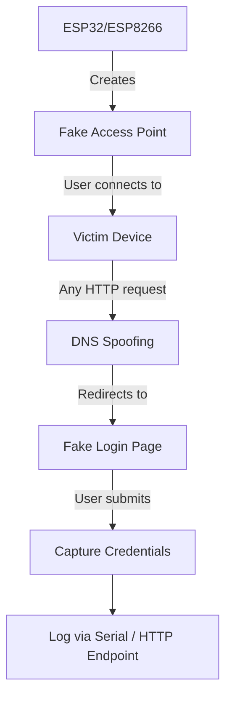

# Wi-Fi Credential Phishing Tool for ESP32

> [!WARNING]
> This project is strictly for **educational and authorized security testing purposes only**.  
> Unauthorized interception, access, or manipulation of networks or user data is **illegal**, unethical, and may result in severe legal consequences.  
> Always obtain explicit written permission before testing on any network or device.

---

## 📌 Overview

This tool is a Wi-Fi phishing attack by creating a rogue access point that mimics a legitimate network. It uses **DNS spoofing** to redirect connected users to a fake captive portal (login page), where unsuspecting users may enter Wi-Fi credentials. The entered credentials are then captured and logged by the device.

This project is designed to **demonstrate common social engineering and network spoofing techniques** so developers, students, and security professionals can better understand and defend against such attacks.

---

## ✨ Features

- Creates a **fake Wi-Fi access point** using ESP32
- Performs **local DNS spoofing** to hijack web requests
- Serves a **customizable fake login (captive portal) page**
- **Logs submitted credentials** via serial output and a `/get_data` HTTP endpoint
- Fully configurable SSID, HTML content, and behavior

> [!NOTE]
> This project currently does **not** support HTTPS interception due to certificate pinning and encryption complexities. 
> For example, users attempting to access `https://` sites will not be redirected to the fake login page. 
> But using **embedded certificates** and advanced techniques may be explored in future iterations.
---

## 🛠️ Requirements

- **Hardware**:
  - ESP32 development board
- **Software**:
  - [Arduino IDE](https://www.arduino.cc/en/software) (v2.0+ recommended)
  - ESP32 board support (installed via Arduino IDE Boards Manager)

---

## 📥 Installation

1. **Install Arduino IDE**  
   Download and install from [arduino.cc/en/software](https://www.arduino.cc/en/software).

2. **Add ESP Board Support**  
   In Arduino IDE:
   - Go to `File > Preferences`
   - Add the appropriate board manager URL:
     - ESP32: `https://raw.githubusercontent.com/espressif/arduino-esp32/gh-pages/package_esp32_index.json`
   - Open `Tools > Board > Boards Manager`, then install **"ESP32 by Espressif Systems"**.

3. **Configure the Code**  
   - Open the provided `.ino` file in Arduino IDE
   - Edit the following in the code:
   
   ```cpp
        WiFi.softAP("SLT Fiber - Free", "");
   ```
   and,
   ```cpp
        String _html = R"rawliteral(<!----Goes Here-->)rawliteral";
   ```
   
   - Customize the captive portal HTML in the `handleRoot()` function or load from the included `template/` folder

4. **Upload & Monitor**
   - Connect your ESP board via USB
   - Select the correct board and port under `Tools`
   - Click **Upload**
   - Open **Serial Monitor** (`Ctrl+Shift+M`) at **115200** baud to view logs and captured credentials

5. **Upload via command line (optional)**  
   You can also use this command to flash the pre-compiled binary:
   ```bash
   esptool.exe --chip esp32 write_flash 0x0 ./dns_spoof_v1.bin
   ```
> [!NOTE]
> You can find pre-compiled binaries in the [release](./releases) section of this repository.

---

## ▶️ Usage

1. Power on the ESP board (via USB or external power)
2. On a mobile device or laptop, connect to the **fake Wi-Fi network** broadcast by the ESP
3. Open any web browser and attempt to visit a website (e.g., `http://example.com`)
4. You’ll be automatically redirected to the **fake login page**
5. If a user enters credentials, they are:
   - Accessible via `http://192.168.4.1/get_data` (while connected to the fake AP)

---

## 🧠 Architecture



---

## ⚖️ Ethical & Legal Disclaimer

This tool **must not** be used to:
- Intercept credentials from individuals without **explicit, informed consent**
- Target networks you do **not own or have written authorization** to test
- Conduct any activity that violates local, national, or international laws (e.g., CFAA, GDPR, etc.)

Use this project **only** in controlled environments such as:
- Personal lab setups
- Authorized penetration tests
- Cybersecurity education/demos (with full disclosure)

The authors and contributors **disclaim all liability** for misuse. Use responsibly.

---

## 📄 License

This project is licensed under the **MIT License**.  
See [LICENSE](LICENSE) for full terms.

---

## 💬 Contributing

Contributions are welcome! Please:
- Open an issue for bugs or feature requests
- Submit PRs with clear descriptions and testing notes
- Respect the project’s ethical boundaries—**no malicious enhancements**

---
[Readme Footer]: ##### (This README was generated with the assistance of AI to ensure clarity and completeness.)
