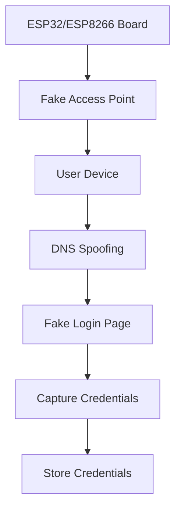

This tool allows users to steal wi-fi passwords from nearby networks without needing to connect to 
them first. 
It uses DNS spoofing and a fake login page to trick users into entering their wi-fi credentials.
# Wi-Fi Password Stealer
> [!WARNING]
> This tool is intended for educational purposes only. Unauthorized access to computer networks is illegal and unethical

## Features
- Spin up a fake access point
- DNS spoofing to redirect users to a fake login page
- Capture and store wi-fi credentials entered by users

## Requirements
- Arduino IDE
- ESP32 or ESP8266 board

## Installation
1. Install the Arduino IDE from [here](https://www.arduino.cc/en/software).
2. Connect your ESP32/ESP8266 board to your computer.
3. Open the Arduino IDE and go to File > Preferences.
4. Upload the code to your board.
    - Change the SSID and PASSWORD variables in the code to set up your fake access point.
    - Change the `_html` variable value in `handle_root` function to customize the fake login page. (predefined HTML is provided in template folder)
5. Open the Serial Monitor to view captured credentials.

## Usage
1. Power on the ESP32/ESP8266 board.
2. Connect to the fake access point created by the board.
3. Open a web browser and try to access any website.
4. You will be redirected to the fake login page.
5. Enter your wi-fi credentials on the fake login page.
6. The credentials will be exposed in `/get_data` endpoint.

## Architecture

## Disclaimer
This tool is for educational purposes only. The author is not responsible for any misuse or illegal activities
conducted using this tool. Always obtain permission before testing on any network.
Unauthorized access to computer networks is illegal and unethical.
Use this tool responsibly and ethically.

## License
This project is licensed under the MIT License - see the [LICENSE](LICENSE) file for details.

---
